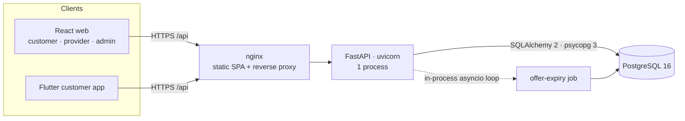

# SafishaCon — Architecture Assessment

**Date:** 2 October 2026 · **Scope:** backend (FastAPI + PostgreSQL), its Docker deployment, and the API contract used by the React and Flutter clients.

**Method:** I read the implementation first: models, services, routes, configuration, Docker files and tests. Then I measured. Every risk below is backed by either a reproducing test or a measurement:

- **Concurrency tests:** 9 race and idempotency tests, run against the original code first.
- **Load testing:** a realistic dataset with 150k bookings, Locust load runs, `pg_stat_statements`, and `EXPLAIN ANALYZE`.
- **Per-request query counts:** each endpoint measured on the original code and on the changed code.
- **Live failure drills:** database outage, process restarts, and proxy-header spoofing.

Measured numbers are in [PERFORMANCE_BASELINE.md](PERFORMANCE_BASELINE.md). The resulting target architecture is in [PRODUCTION_ARCHITECTURE.md](PRODUCTION_ARCHITECTURE.md), and the decisions are in [architecture/](architecture/).

---

## 1. Current architecture (as found)



| Component | Implementation | Notes |
|---|---|---|
| API | FastAPI, **synchronous** `def` endpoints, SQLAlchemy 2 ORM, psycopg 3 | Sync endpoints run in AnyIO's thread pool (40 threads), so blocking DB I/O never blocks the event loop. |
| Database | PostgreSQL 16, 24 tables, Alembic migration `0001` | Money is `NUMERIC(12,2)` plus Python `Decimal`. A CHECK constraint enforces `commission + earning = total`. Enums are stored as VARCHAR with CHECK constraints. |
| Auth | JWT access tokens (30 min); refresh tokens are hashed, rotated, and reuse is detected | Each request loads the user by primary key, so suspensions take effect immediately. |
| RBAC | FastAPI dependencies (`require_roles`, `CurrentCustomer`, `CurrentProvider`) | Lookups are scoped to the owner. "Not yours" returns the same 404 as "missing". |
| Booking flow | Explicit state machine (`lifecycle.TRANSITIONS`, keyed by actor) | All status changes go through `transition()`, which also writes the history. |
| Assignment | Deterministic eligibility and ranking, plus an offer with a TTL, then re-dispatch | Expiry was handled by an asyncio loop inside each API process. |
| Payments | Gateway abstraction. Cash is fully implemented; digital methods are "coming soon" | Settlement is created when the booking closes. |
| Notifications | In-app rows written in the same transaction | When configured, SMS was called **synchronously inside the request**. |
| Observability | JSON logs and an `X-Request-ID` header | No metrics, no liveness/readiness split, and logs written from inside services were not correlated to the request. |
| Deployment | docker compose: db, api, and web (nginx) | uvicorn ran with `--forwarded-allow-ips "*"`. |

### Request flow (unchanged by this work)

1. nginx serves the SPA and proxies `/api/*` to uvicorn.
2. A middleware assigns a request ID.
3. The router validates the request with Pydantic and resolves dependencies: DB session, then user, then role.
4. The service layer runs one transaction, and the route commits it.
5. The view layer builds role-aware responses, including `allowed_actions`.

### Booking, assignment and payment flow

```mermaid
sequenceDiagram
  participant C as Customer
  participant API
  participant DB as PostgreSQL
  participant P as Provider
  participant W as Expiry job
  C->>API: POST /bookings (quote → price snapshot → payment row)
  API->>DB: INSERT booking, items, history, payment; CONFIRMED → FINDING_PROVIDER
  API->>DB: find eligible providers, INSERT offer (TTL)
  P->>API: POST /assignments/{id}/accept
  API->>DB: capacity check, ACCEPTED, booking PROVIDER_ASSIGNED
  W->>DB: offers past TTL → EXPIRED, re-dispatch
  P->>API: advance … COMPLETED_BY_PROVIDER
  C->>API: confirm completion → CUSTOMER_CONFIRMED
  P->>API: confirm cash → payment PAID → CLOSED + settlement
```

---

## 2. Findings

Severity follows the brief:

- **CRITICAL:** corruption, duplicates, money or unauthorized access.
- **HIGH:** likely production reliability or performance problems.
- **MEDIUM:** fix before meaningful growth.
- **LOW:** optimisation or future work.

"Evidence" says how each finding was demonstrated.

### CRITICAL — all fixed

| # | Finding | Evidence (original code) | Fix |
|---|---|---|---|
| C1 | **Lost updates on bookings.** Customer confirm/cancel/complete, complaint creation, admin status/payment changes and provider withdrawal all read the booking without a lock, so concurrent writers overwrote each other. | Test `test_customer_cancel_racing_provider_accept`: the booking ended CANCELLED, but the history chain went from `FINDING_PROVIDER` straight to `CANCELLED`, losing the provider's accept. | Every mutating path now locks the booking row (`SELECT … FOR NO KEY UPDATE`, re-read with `populate_existing`). Bookings, payments and settlements also carry an optimistic `version_id`, so any remaining stale write fails with a 409 instead of overwriting. |
| C2 | **A provider could be double-booked.** Two concurrent accepts of overlapping jobs each checked capacity before the other committed. | `test_provider_cannot_accept_two_overlapping_jobs_concurrently`. | The provider row is locked before capacity is checked and consumed. Lock order is booking, then provider, so no lock-order deadlocks are possible. |
| C3 | **The expiry job raced a last-second accept.** The job locked the assignment and the accept locked the booking, in opposite orders. Result: a deadlock (one side aborted). With different timing it could expire and re-offer a booking that was just accepted, leaving two providers with open assignments. | `test_offer_accepted_while_expiry_job_runs`: `OperationalError` (deadlock) in the job. | The job now locks the **booking** first with `SKIP LOCKED`, so a booking someone is acting on is retried next pass. It processes one offer per transaction. |
| C4 | **No database guarantee of one open assignment per booking.** Only application code prevented double assignment. | `test_database_rejects_second_open_assignment`: the insert succeeded. | Added a partial unique index `uq_assignments_one_open_per_booking (booking_id) WHERE status IN ('OFFERED','ACCEPTED')`. Migration 0002 repairs any legacy duplicates first. |
| C5 | **A settlement could be paid out twice.** Two admins, or one double click, both "succeeded". The payout reference was overwritten and audit entries and notifications duplicated. | `test_settlement_cannot_be_paid_out_twice`: `('ok','ok')`. | The settlement row is locked and re-read. The second attempt gets `409 ALREADY_SETTLED`. |
| C6 | **Booking creation was not idempotent.** The Flutter app already sent an `Idempotency-Key`, but the server ignored it. Retries on flaky mobile data, or double taps, created duplicate bookings, each with its own payment and provider offer. | `test_duplicate_booking_submissions_with_same_idempotency_key`: 8 parallel identical requests created **8 bookings**. | The key is stored with a unique constraint on `(customer_id, idempotency_key)` plus a request fingerprint. A replay returns the original booking (`200`, `Idempotent-Replayed: true`). Reusing the key with a different payload returns `409 IDEMPOTENCY_KEY_REUSED`. The concurrent-insert race is resolved by the constraint. The web client now sends a key too. |

### HIGH — all fixed

| # | Finding | Evidence | Fix |
|---|---|---|---|
| H1 | **Unbounded, N+1 provider endpoints.** The "completed jobs" list returned every job with full detail. The dashboard computed lifetime earnings by loading every booking and lazy-loading each payment. | At 150k bookings, one request ran **2,883 SQL statements and returned 1.8 MB** (jobs), 524 (dashboard) and 518 (earnings). Under 60 users, p50 was **85 s / 13 s / 20 s**. | Job lists: `limit` (default 50, max 200) and batched eager loading. Earnings: totals by SQL aggregate; rows limited (default 100). Now **9–10 statements**, p50 140–230 ms. |
| H2 | **The availability endpoint ran full eligibility 11 times** (once per slot) and re-read settings for each slot. | 54 statements per request; p50 3.4 s under load. | Candidates, hours and commitments are loaded once, then all slots are evaluated in memory. Settings are cached per session. Now **6 statements**, p50 57 ms. |
| H3 | **Two overlapping offers blocked each other.** At acceptance, other *offers* counted as commitments, so a provider holding two overlapping offers could accept **neither** until they expired. | Same test as C2 returned `SCHEDULE_CONFLICT` for both. | At acceptance, capacity counts only **accepted** jobs. Offers still count as soft holds when matching. |
| H4 | **Client IP spoofable.** uvicorn ran with `--forwarded-allow-ips "*"`, so any caller could set `X-Forwarded-For` and bypass per-IP login rate limits or forge audit IPs. | Configuration review, then verified live. | `FORWARDED_ALLOW_IPS` lists only the proxy; compose gives nginx a fixed address. nginx overwrites (does not append) `X-Forwarded-For`. Production startup refuses `*`. Verified: a spoofed `6.6.6.6` is never recorded. |
| H5 | **No database timeouts.** There was no statement or lock timeout, the pool default was a 30 s wait, and database failures surfaced as generic 500s. Under load, requests waited up to 85 s. | Load test (max 85 s); configuration review. | Settings now include `statement_timeout`, `lock_timeout`, `idle_in_transaction_session_timeout`, connect timeout and pool timeout, all configured by environment variable. Pool exhaustion, lock contention and outages map to 503/409 with `Retry-After` and are logged. |
| H6 | **Background job tied to API processes.** Offer expiry ran in an asyncio loop inside every API process. Restarts paused it, more replicas multiplied it, and every expired offer in a batch shared one transaction, so one failure rolled back all of them. | Code review; see C3. | A dedicated worker (`python -m app.worker`) with per-item transactions, `SKIP LOCKED`, SIGTERM handling, a heartbeat health check and job metrics. API containers run with `BACKGROUND_JOBS_ENABLED=false`. |
| H7 | **SMS inside the business transaction.** When an SMS provider was configured, it was called synchronously before commit, so a slow gateway slowed bookings while holding locks. | Code review. | Transactional outbox: `notify()` only writes the row (with `delivery_status=PENDING`). The worker delivers after commit with exponential backoff (1, 2, 4, 8… min) and gives up after `NOTIFICATION_MAX_ATTEMPTS`. Tested with a failing gateway. |
| H8 | **Missing or ineffective indexes** for the expiry scan, admin payments and settlements pages, landing testimonials, and the notification inbox. | `EXPLAIN ANALYZE` at 150k bookings: 47 / 32 / 25 / 11 ms with sequential or full scans. | Query-driven indexes (see §4). After: 0.04 / 0.10 / 0.18 / 0.12 ms. |
| H9 | **The audit log never recorded an IP address.** A `client_ip` helper existed but was never called. | Found during the live spoofing test. | The client IP (resolved only through trusted proxies) is captured in the request context and recorded by default. |
| H10 | **No liveness/readiness split.** `/health` hit the database, so a database blip would make an orchestrator restart healthy API containers. | Configuration review. | `/health/live` (process only) and `/health/ready` (database ping, 2 s statement timeout, 503 with no details). `/health` is kept as an alias. |

### MEDIUM

| # | Finding | Status |
|---|---|---|
| M1 | Admin free-text search (`ILIKE '%term%'` on reference, name and phone across a join) runs sequential scans: **≈220 ms** at 150k bookings / 30k users. | **Deferred, measured.** Acceptable for a handful of admins. Add `pg_trgm` GIN indexes when it exceeds about 500 ms or bookings pass about 1M. |
| M2 | Provider job lists return full booking detail per job (≈3 KB each). | Mitigated: lists are capped at 50. A summary schema would change the web/Flutter contract, so it is left for a coordinated client release. |
| M3 | The rate limiter is in-process: with N processes, the effective limit is N × limit. | Accepted for the pilot. A shared edge limit (nginx `limit_req`) now protects credential endpoints. Redis comes in when several API replicas serve real traffic ([ADR-002](architecture/ADR-002-redis.md)). |
| M4 | Tanzanian mobile networks use carrier-grade NAT, so many customers can share one IP and per-IP limits may throttle innocent users. | Limits are deliberately generous (20/min per IP and path in the app; 30/min with a burst of 20 at the edge) and apply only to credential endpoints. Watch `429` rates. |
| M5 | Migrations run when the API container starts. | Now safe with concurrent replicas (PostgreSQL advisory lock in `alembic/env.py`). At Stage B, move them to a one-off release job. |
| M6 | Migration 0002 builds indexes with plain `CREATE INDEX`, which blocks writes. | It took **6.6 s** on the 150k-booking dataset. Use `CONCURRENTLY` once tables are large and writes are continuous. |
| M7 | `/metrics` is served on the API port. | nginx does not proxy it; `METRICS_TOKEN` can require a bearer token. Don't publish port 8000 in production. |
| M8 | A database outage makes requests fail after ≈8 s (5 s connect timeout plus DNS for the missing host). | Acceptable: clean 503s. Lower `DB_CONNECT_TIMEOUT_SECONDS` if the orchestrator's probe timeout is shorter. |
| M9 | Each authenticated request loads the user (one primary-key query). | **Kept deliberately:** suspending an account or changing a role takes effect immediately. Revisit only if it shows up in profiles. |
| M10 | There was no backup or restore procedure. | Documented in [BACKUP_AND_RECOVERY.md](BACKUP_AND_RECOVERY.md); needs automation in the hosting environment. |

### LOW

- **L1.** The customer booking list is capped at 200 (default 50) and is not paginated. Customers have about 5 bookings each; add cursor pagination when needed.
- **L2.** `notifications` (428k rows in the test data) and `booking_status_history` (1.3M) grow without bound. Add a retention policy for read notifications older than 12 months.
- **L3.** Python CPU, not PostgreSQL, is the throughput limit: about 40 req/s per 2-vCPU container under this traffic mix. Scale by adding CPU or replicas (see the production architecture).
- **L4.** Response compression for API JSON happens at nginx (`gzip_proxied any`), which is fine.
- **L5.** The uvicorn keep-alive timeout was raised from 5 s to 15 s so it outlasts typical client idle gaps. A 5 s timeout caused rare `RemoteDisconnected` errors in the load tests.

### Checked and found sound

- **Money:** `NUMERIC(12,2)` with `Decimal` end to end, a CHECK constraint `commission_amount + provider_earning = total_amount`, and an immutable pricing snapshot with line items on each booking. The new gateway path only accepts an amount that **exactly** matches that snapshot.
- **State machine:** every transition is validated server-side per actor. Invalid moves such as `CLOSED → SERVICE_IN_PROGRESS` are rejected (existing tests). The new history-chain invariant check found no gaps after the fixes.
- **Async vs sync:** there are no `async def` endpoints doing blocking work. The design stays **fully synchronous** ([ADR-001](architecture/ADR-001-database.md)).
- **Secrets and CORS:** secrets are not committed and `.env.example` is provided. Production startup refuses the development JWT secret, demo mode, a CORS regex, wildcard origins, wildcard trusted proxies, and the development DB credentials. `allow_credentials=False` (bearer tokens, no cookies).
- **File uploads:** there are none in the MVP (verification is manual). When they arrive, store them in object storage (S3-compatible), never in PostgreSQL. See the production architecture.
- **Pagination:** admin lists are paginated with bounded page sizes.

---

## 3. Concurrency scenarios (from the brief) and their outcome

| Scenario | Protection | Test |
|---|---|---|
| Two customers book simultaneously | Independent rows. The dispatcher locks each candidate provider with `SKIP LOCKED` and re-checks capacity, so two dispatches cannot both reserve a provider's last slot. | Load runs created 741 bookings and 549 offers concurrently. Post-run audit: 0 bookings with more than one open assignment, 0 history chains out of sync, and 0 instants where a provider's live commitments exceeded capacity (sweep over 456 provider-days). |
| Two providers accept the same booking | The booking lock serialises them; the second sees the offer is gone. The partial unique index is the backstop. | `test_database_rejects_second_open_assignment`, `test_offer_accepted_while_expiry_job_runs` |
| Provider accepts overlapping bookings | Provider row lock plus a capacity re-check | `test_provider_cannot_accept_two_overlapping_jobs_concurrently` |
| Admin and provider update a booking simultaneously | Booking lock plus `version_id` | `test_customer_cancel_racing_provider_accept` |
| Customer confirms while admin modifies | Booking lock (all customer and admin mutations) | same mechanism |
| Two payment confirmations | Booking lock. Confirming an already-paid payment returns it unchanged. A single settlement (unique `booking_id`). | `test_cash_confirmed_twice_records_single_payment` (provider and admin, 6 in parallel) |
| Duplicate gateway callbacks | Ledger insert `ON CONFLICT DO NOTHING` on `(gateway, dedupe_key)` | `test_duplicate_gateway_callbacks_apply_once` |
| Duplicate booking submission | Idempotency key plus unique constraint | `test_duplicate_booking_submissions_with_same_idempotency_key` |
| Double-tapped accept | The replay returns the same accepted job | `test_double_tapped_accept_is_idempotent` |

Each concurrency test ends by checking marketplace-wide invariants:

- one open assignment per booking;
- assigned bookings are backed by exactly one accepted assignment;
- no provider is over capacity;
- money balances;
- the history chain is unbroken;
- settlements exist only for paid bookings.

---

## 4. Index changes (migration 0002)

| Index | Serves | Measured |
|---|---|---|
| `uq_assignments_one_open_per_booking` (partial, unique) | Integrity (C4) and lookups of the open offer | — |
| `ix_assignments_open_offer_expiry` (partial: `status='OFFERED'`), replacing a full `expires_at` index | Worker expiry scan | 47 → 0.04 ms |
| `ix_bookings_status_schedule (status, scheduled_date)`, replacing `ix_bookings_status` | Admin queues; capacity checks | 0.68 → 0.26 ms; capacity 1.08 → 0.28 ms |
| `uq_bookings_customer_idempotency_key (customer_id, idempotency_key)`, replacing `ix_bookings_customer_id` | Idempotency **and** customer history (the planner uses its `customer_id` prefix) | 0.13 → 0.23 ms (both sub-millisecond) |
| `ix_bookings_provider_schedule` (existing) now also replaces the redundant `ix_bookings_provider_id` | Provider schedule and jobs | — |
| `ix_payments_created_at`, `ix_provider_settlements_created_at` | Admin money pages | 32 → 0.10 ms; 25 → 0.18 ms |
| `ix_reviews_visible_recent` (partial: not hidden) | Landing testimonials | 11 → 0.12 ms |
| `ix_notifications_user_created (user_id, created_at)` | Notification inbox | 1.4 → 0.11 ms |
| `ix_notifications_delivery_due` (partial: `PENDING`) | Outbox scan | — |
| `uq_payments_gateway_reference` (partial), `uq_payment_gateway_events_dedupe` | Payment idempotency | — |

**Considered and rejected:** a `(customer_id, scheduled_date)` index for customer history. The planner never chose it, because customers have few bookings each and the idempotency index's prefix suffices. I removed it after measuring. Trigram indexes for admin search are deferred (M1). Three redundant single-column indexes were dropped, which lowers write cost.
