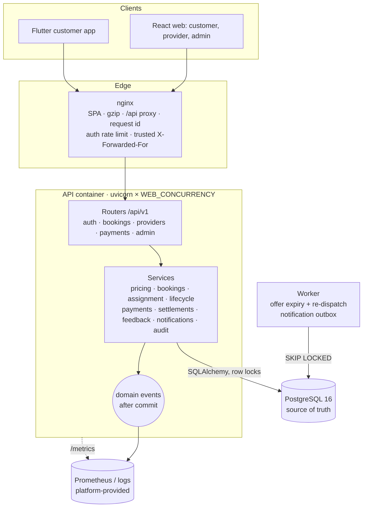
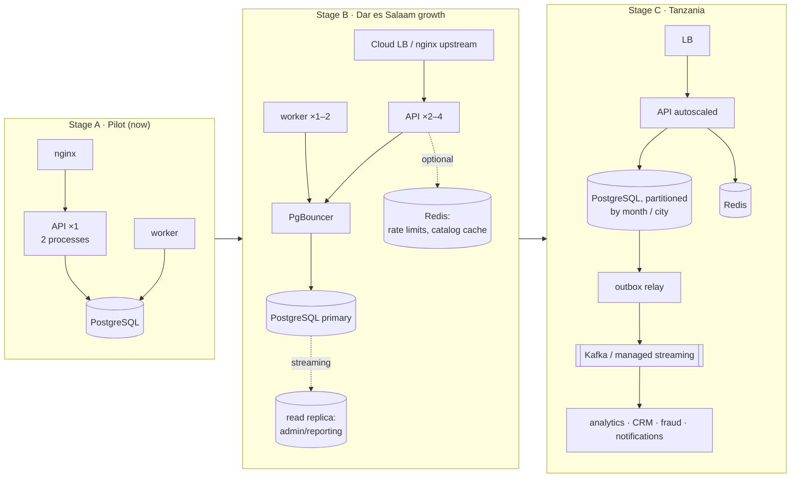

# SafishaCon — Production Architecture

The simplest architecture that can safely carry real customers, and how it grows.

The evidence behind each choice is in [ARCHITECTURE_ASSESSMENT.md](ARCHITECTURE_ASSESSMENT.md) and [PERFORMANCE_BASELINE.md](PERFORMANCE_BASELINE.md). The individual decisions are in [architecture/](architecture/).

| Decision | Status | Record |
|---|---|---|
| PostgreSQL, the single source of truth | **Adopted** | [ADR-001](architecture/ADR-001-database.md) |
| PostgreSQL row locking, version columns and constraints | **Adopted** | [ADR-001](architecture/ADR-001-database.md) |
| Background worker (PostgreSQL-backed, no broker) | **Adopted** | [ADR-005](architecture/ADR-005-background-jobs.md) |
| Prometheus metrics, structured logs, request IDs | **Adopted** | [ADR-006](architecture/ADR-006-observability.md) |
| Redis | **Deferred** | [ADR-002](architecture/ADR-002-redis.md) |
| HAProxy | **Deferred** | [ADR-003](architecture/ADR-003-haproxy.md) |
| Kafka | **Deferred** (in-process domain events adopted) | [ADR-004](architecture/ADR-004-kafka.md) |
| Microservices | **Not adopted.** SafishaCon stays a modular monolith. | this page |

---

## 1. Current architecture: a modular monolith



The module boundaries live in code, not in deployment units:

- auth;
- customers and providers (profile, verification);
- catalog and pricing;
- bookings and lifecycle;
- assignment;
- payments and settlements;
- reviews and complaints;
- notifications;
- admin;
- audit.

Services talk to each other through function calls and one PostgreSQL transaction. Side effects that don't need to be atomic go out as domain events. Any module can later be extracted behind its existing service interface. Doing that today would buy network failure modes and no benefit.

## 2. Pilot deployment (Stage A: 10–20 providers, a first few hundred customers)

**Minimum production setup:**

| Component | Size | Notes |
|---|---|---|
| Edge | Managed TLS (cloud load balancer, Cloudflare, or nginx with Let's Encrypt) | Expose **only** nginx (80/443). Do **not** publish the API port 8000. |
| `web` (nginx) | 0.25 vCPU / 128 MB | Static SPA plus the `/api` proxy |
| `api` | **2 vCPU / 1 GB, `WEB_CONCURRENCY=2`** | Measured at about 40 req/s for the realistic mix with p95 390 ms at 60 concurrent users. Pilot peak is under 1 req/s. |
| `worker` | 0.25 vCPU / 256 MB | `python -m app.worker`, a pool of 2 connections |
| PostgreSQL | **Managed** PostgreSQL 16 (2 vCPU / 4 GB, 20 GB SSD), automated backups plus PITR | Self-hosting is possible, but then [BACKUP_AND_RECOVERY.md](BACKUP_AND_RECOVERY.md) is your job |
| Monitoring | Hosted Prometheus/Grafana or the platform agent scraping `/metrics`; logs to the platform's log store | Alerts are listed in [ADR-006](architecture/ADR-006-observability.md) |

**Estimated cost:** a single small VM (or two) plus a managed database, roughly US$40–80/month at typical cloud prices. A single 2–4 vCPU VM running this compose file, plus a managed database, is a perfectly good pilot.

### Required production configuration

The API refuses to start in production without these:

```env
ENVIRONMENT=production
JWT_SECRET=<48+ random bytes>
DEMO_MODE=false
RUN_SEED=false                      # or python -m app.seed --reference-only once
CORS_ORIGINS=https://app.example.co.tz   # explicit list, no "*", no regex
CORS_ORIGIN_REGEX=
FORWARDED_ALLOW_IPS=<address of your proxy>   # never "*"
DATABASE_URL=postgresql://<app user>:<strong password>@<host>/<db>?sslmode=require
METRICS_TOKEN=<random>              # if /metrics is reachable beyond the private network
```

## 3. Process model

- **One uvicorn process per vCPU** (`WEB_CONCURRENCY`). The endpoints are synchronous: each process runs requests in a 40-thread pool, and DB waits release the GIL. Throughput is bounded by Python CPU, so extra processes beyond the vCPU count add memory and connections, not throughput.
  - Measured on 2 vCPUs: 1 process gave p50 110 ms and p99 1.3 s; 2 processes gave p50 48 ms and p99 860 ms.
  - I deliberately did **not** use "2 × CPU + 1".
- `--timeout-graceful-shutdown 20` and `stop_grace_period: 30s`. SIGTERM stops new connections, drains in-flight requests, runs shutdown hooks (job loop stop, `engine.dispose()`), then exits. Verified with `docker compose restart`.
- No `--reload` in containers. `--no-server-header`; the access log comes from the app's JSON logger.
- Keep-alive is 15 s, longer than typical client idle gaps.

## 4. Database strategy

- PostgreSQL holds all state. See [ADR-001](architecture/ADR-001-database.md) for the locking, timeouts and constraints.
- **Connection budget:** `(API containers × WEB_CONCURRENCY × (DB_POOL_SIZE + DB_MAX_OVERFLOW)) + worker pool + 10 for admin and migrations` must stay below `max_connections` (100 by default; managed tiers vary).
  - Pilot: 1 × 2 × 10 + 2 + 10 = **32**.
  - At Stage B with 4 containers: 4 × 2 × 10 + 2 + 10 = **92**. Add PgBouncer (transaction pooling) before going beyond that.
- **Migrations:** run on API start, protected by a PostgreSQL advisory lock so concurrent replicas are safe. At Stage B, run `alembic upgrade head` as a one-off release job instead. Build large indexes with `CREATE INDEX CONCURRENTLY`.
- **Indexes** are driven by measured query plans ([assessment §4](ARCHITECTURE_ASSESSMENT.md#4-index-changes-migration-0002)). Redundant ones are removed.

## 5. Concurrency strategy

| Operation | Atomic unit | Protection |
|---|---|---|
| Create booking with price snapshot and payment | One transaction | `Idempotency-Key` with a unique `(customer_id, key)` constraint; request fingerprint |
| Dispatch (offer to the best provider) | Inside the booking's transaction | Booking lock held by the caller. Candidate provider locked with `SKIP LOCKED`, capacity re-checked. One-open-assignment unique index. |
| Accept offer | One transaction | Lock booking, re-read the offer, lock provider, capacity check (accepted jobs only). Replays are idempotent. |
| Status transitions (provider, customer, admin) | One transaction | Booking lock, state machine per actor, `version_id` |
| Offer expiry | One transaction per offer | Booking lock with `SKIP LOCKED` (skip what users are touching), re-check |
| Cash confirmation, then close and create settlement | One transaction | Booking lock. Confirming an already-paid payment returns it unchanged. Unique settlement per booking. |
| Gateway callback (future) | One transaction | Ledger insert `ON CONFLICT DO NOTHING` on `(gateway, dedupe_key)`. Amount must equal the snapshot exactly. Unique `(gateway, gateway_reference)`. |
| Settlement payout | One transaction | Settlement row lock. A second attempt gets `409 ALREADY_SETTLED`. |

**Lock order is always booking → provider.** The worker and dispatcher never wait on a lock (`SKIP LOCKED`), and every other wait is bounded by `lock_timeout`. All of this is covered by `tests/test_concurrency.py`.

## 6. Background processing

A dedicated worker with no broker. See [ADR-005](architecture/ADR-005-background-jobs.md).

- **Offer expiry:** about 30 s scheduling resolution against a 30-minute TTL.
- **Notification outbox:** in-app notifications are written in the business transaction. SMS and push are delivered by the worker after commit, with timeouts, exponential backoff and a cap on attempts.
- **Restarts:** restarting the API never pauses expiry. Restarting the worker loses nothing, because the state is in PostgreSQL.

## 7. Caching

- **None across requests.** Platform settings are cached **per request** (one query instead of up to 22), so an admin's commission change applies to the very next request.
- Static assets are cached by nginx and browsers (immutable hashed files).
- The API JSON is gzip-compressed by nginx.

Redis caching of the public catalog is the first step if it is ever needed ([ADR-002](architecture/ADR-002-redis.md)).

## 8. Load balancing

nginx is the only proxy. Inside a container, uvicorn's processes share the listening socket. Multiple API containers sit behind the platform's load balancer, or an nginx `upstream`. See [ADR-003](architecture/ADR-003-haproxy.md).

The application is **stateless**, so replicas need no code changes:

- JWT authentication; refresh tokens stored in the database;
- locks and idempotency in PostgreSQL;
- the worker separated from the API;
- migrations under an advisory lock.

The one per-process element is the rate limiter. A shared edge limit at nginx covers it; Redis comes in if exact limits across replicas are needed.

## 9. Event architecture

In-process domain events (`app/core/events.py`) are dispatched **after commit**. Today's subscribers are metrics and logs. The upgrade path is an outbox table, then a relay, then Kafka, and it is additive with no changes to business code. See [ADR-004](architecture/ADR-004-kafka.md).

## 10. Observability

- JSON logs with `request_id` and `user_id` on every line, route-template access logs with per-request SQL counts, and slow-request warnings.
- Prometheus `/metrics`: HTTP, pool, business events, jobs and live open bookings.
- `/health/live` and `/health/ready`.
- `pg_stat_statements` in PostgreSQL.

Details and alerts are in [ADR-006](architecture/ADR-006-observability.md).

## 11. Security

- **Credentials:**
  - JWT HS256 with a 30-minute access token.
  - Refresh tokens are hashed, rotated, and reuse is detected.
  - bcrypt with 12 rounds.
  - The user is reloaded on every request, so suspensions apply immediately.
- **Access control:** RBAC dependencies, owner-scoped lookups (404 for "not yours"), and server-computed `allowed_actions`.
- **Abuse limits:**
  - Login, registration, refresh and password change: 20 per minute per IP and path (per process). At the edge (nginx): 30 per minute with a burst of 20.
  - Booking, review and complaint creation: 30 per minute per account.
  - Limits are generous on purpose, because mobile carrier NAT puts many customers behind one IP.
- **Proxy trust:**
  - Only addresses in `FORWARDED_ALLOW_IPS` may set the client IP, and production refuses `*`.
  - nginx overwrites `X-Forwarded-For`.
  - Audit logs record the resolved client IP.
- **CORS:** an explicit origin list. `allow_credentials=False`, because bearer tokens are used and there are no cookies.
- **Secrets:** environment variables only. `.env` is gitignored and `.env.example` is provided. Production startup fails on the development JWT secret, demo mode, a CORS wildcard or regex, a proxy wildcard, or the development DB credentials.
- **Containers:** multi-stage image, non-root user (uid 10001), health checks, no build tools in the runtime image.
- **Future file uploads** (verification documents, photos):
  - store them in S3-compatible object storage via a storage interface (local disk in development), never in PostgreSQL;
  - validate size, MIME type and magic bytes;
  - serve through short-lived signed URLs, checking authorization against the owner or admin.

## 12. Backup and recovery

Managed PostgreSQL with daily snapshots plus point-in-time recovery (7–35 days), a logical `pg_dump` weekly copy off-platform, and a quarterly restore test. See [BACKUP_AND_RECOVERY.md](BACKUP_AND_RECOVERY.md).

## 13. Failure handling

| Failure | Behaviour (verified where marked ✓) |
|---|---|
| PostgreSQL unavailable | `/health/live` 200; `/health/ready` 503; API requests get `503 SERVICE_UNAVAILABLE` with a request ID; recovery is automatic when the DB returns, thanks to `pool_pre_ping` ✓ |
| Pool exhausted (overload) | `503 SERVICE_BUSY` with `Retry-After` within 5 s, instead of queuing for a minute ✓ (stress test) |
| Lock contention / deadlock | `409 CONCURRENT_UPDATE` ("please retry"), bounded by `lock_timeout` |
| Runaway query | Cancelled at 15 s (`statement_timeout`), then 503 |
| API instance crash or restart | In-flight transactions roll back (nothing half-written). Graceful drain on SIGTERM ✓. Clients retry; booking creation is idempotent ✓ |
| Restart during assignment | Assignment is one transaction, committed or not. An offer without a response is expired by the worker and re-dispatched |
| Worker down | Offers stop expiring; bookings wait; providers can't accept expired offers; the health check fails; it catches up on restart |
| SMS provider down | Booking unaffected; the message is retried with backoff, then marked `FAILED` ✓ |
| Customer repeats a booking request | Same `Idempotency-Key`, same booking ✓ (web and Flutter both send keys) |
| Admin repeats a cash confirmation | Same payment returned; one settlement ✓ |
| Duplicate payment callback | Recorded once, applied once ✓ |
| Provider double-taps accept | Same accepted job ✓ |

## 14. Scaling strategy and future triggers



| Trigger (measure it) | Action |
|---|---|
| API CPU above 70% at peak, or p95 above 500 ms | Raise vCPUs and `WEB_CONCURRENCY`, then add API containers behind the LB |
| More than one API container in production **and** exact rate limits are needed | Redis-backed limiter ([ADR-002](architecture/ADR-002-redis.md)) |
| Connection budget would exceed about 80% of `max_connections` | PgBouncer (transaction mode) |
| Admin or reporting queries visible in primary p95, or PostgreSQL CPU above 60% | Read replica for admin lists, stats and exports |
| Admin search p95 above 500 ms (≈220 ms at 150k bookings today) | `pg_trgm` GIN indexes on name, phone and reference |
| `bookings` above about 10M rows, or multi-city isolation needed | Partition `bookings` and `booking_status_history` by month or city |
| Three or more independent event consumers, or replay needed | Outbox relay, then Kafka ([ADR-004](architecture/ADR-004-kafka.md)) |
| Long-running jobs (reports, image processing) or sub-second scheduling | A queue (RQ/Celery or SQS) for those jobs only ([ADR-005](architecture/ADR-005-background-jobs.md)) |
| Multiple API hosts without a managed LB and active health checks needed | HAProxy ([ADR-003](architecture/ADR-003-haproxy.md)) |
| A team or domain needs an independent deploy cadence, with its data separable | Extract that module, assignment or payments first, behind its existing service interface |
